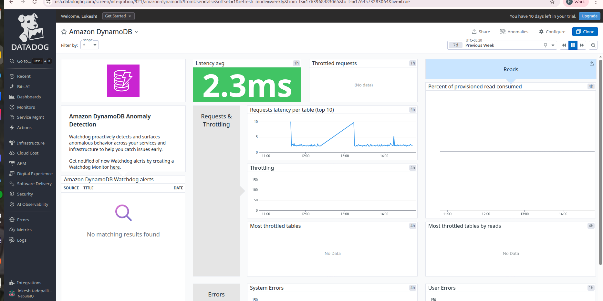

# **Amazon DynamoDB Dashboard — Metrics Documentation**

---

## **1. Latency avg**
- **Metric Name:** `aws.dynamodb.successful_request_latency`
- **Aggregation Used:** avg
- **Unit:** milliseconds (ms)
- **Title in UI:** Latency avg
- **Description:** Shows the average successful request latency across DynamoDB tables.How long DynamoDB takes to respond to your requests.

  Lower latency = faster database = better performance.

---

## **2. Throttled requests**
- **Metric Name:** `aws.dynamodb.throttled_requests`
- **Aggregation Used:** sum
- **Unit:** count
- **Title in UI:** Throttled requests
- **Description:** Number of throttled requests due to exceeding provisioned throughput. Requests DynamoDB refused to process because you exceeded your table’s capacity.
  *(Shows “No Data” if tables use On-Demand capacity mode).*

If this shows 0, it means your application is not overloading DynamoDB.

---

## **3. Requests latency per table (top 10)**
- **Metric Name:** `aws.dynamodb.successful_request_latency`
- **Aggregation Used:** avg
- **Group By:** table_name
- **Unit:** milliseconds (ms)
- **Title in UI:** Requests latency per table (top 10)
- **Description:** Displays per-table latency, identifying tables with higher request latency. Shows which tables are slowest in terms of response time. 

Higher latency = slower table performance.

---

## **4. Throttling**
- **Metric Name:** `aws.dynamodb.throttled_requests`
- **Aggregation Used:** sum
- **Unit:** count
- **Title in UI:** Throttling
- **Description:** Shows request throttling across DynamoDB tables. Overall view of how many requests DynamoDB blocked due to high usage.
  *(Shows “No Data” if no throttling events have occurred).*

If too many people try to open the same door at once, some will be pushed back.
DynamoDB does the same — pushes back extra requests when overloaded.

This graph shows when and how often that happened.

---

## **5. Most throttled tables**
- **Metric Name:** `aws.dynamodb.throttled_requests`
- **Aggregation Used:** sum
- **Group By:** table_name
- **Unit:** count
- **Title in UI:** Most throttled tables
- **Description:** Lists the tables experiencing the most throttling. Shows which specific tables are getting throttled the most.  
  *(Displays “No Data” when there is no throttling).*

It helps you quickly identify problem tables.  

---

## **6. Reads — Percent of provisioned read consumed**
- **Metric Name:** `aws.dynamodb.consumed_read_capacity_units`
- **Aggregation Used:** avg
- **Unit:** percent (%)
- **Title in UI:** Percent of provisioned read consumed
- **Description:** Shows the percentage of the table’s provisioned read capacity that has been consumed. How much of your allocated read capacity is being used. 
  *(If the table uses On-Demand capacity, this graph may show “No Data”).*

Suppose your phone plan allows 10GB of data per month.
If you use 5GB, that’s 50% consumed.

Similarly:

If provisioned reads = 100

and you use 50

You consumed 50% of your limit.

If this goes above 80–90%, you risk throttling.

---

## **7. Most throttled tables by reads**
- **Metric Name:** `aws.dynamodb.read_throttle_events`
- **Aggregation Used:** sum
- **Unit:** count
- **Title in UI:** Most throttled tables by reads
- **Description:** Identifies tables that are throttled specifically for read operations. Shows which tables are throttled because too many read requests were made.

This helps you find which tables need more read capacity.  

---

## **8. System Errors**
- **Metric Name:** `aws.dynamodb.system_errors`
- **Aggregation Used:** sum
- **Unit:** count
- **Title in UI:** System Errors
- **Description:** Displays system-level DynamoDB errors (service-side errors). Errors that occurred inside DynamoDB itself.

  These errors usually come from AWS internal issues, not your application.

---

## **9. User Errors**
- **Metric Name:** `aws.dynamodb.user_errors`
- **Aggregation Used:** sum
- **Unit:** count
- **Title in UI:** User Errors
- **Description:** Displays errors caused by invalid user requests (client-side errors). Errors caused by incorrect usage from your application.

This is like typing a wrong password or asking for something that doesn’t exist.

Examples:

Requesting an invalid key

Querying a table that doesn’t exist

Incorrect parameters

These are mistakes in your code, not DynamoDB’s fault.  

---

## **10. Percent of provisioned write consumed**
- **Metric Name:** `aws.dynamodb.consumed_write_capacity_units`
- **Aggregation Used:** avg  
- **Unit:** percent (%)  
- **Title in UI:** Percent of provisioned write consumed  
- **Description:** This tells you **how much of your DynamoDB write capacity you are actually using**.  
  Think of provisioned capacity like a “monthly data plan.”  
  - If you are allowed to use 100 units per second, and you use 50, then you have used 50% of your plan.  
  This metric helps you understand if your table is:  
  - **Operating normally**  
  - **Getting close to max capacity** (high % usage)  
  - **At risk of throttling** if usage crosses capacity limits  
  If your table is On-Demand mode, it may show **“No Data”** because this concept applies mainly to provisioned capacity.

---

## **11. Most throttled tables by writes**
- **Metric Name:** `aws.dynamodb.write_throttle_events`
- **Aggregation Used:** sum  
- **Unit:** count  
- **Title in UI:** Most throttled tables by writes  
- **Description (Layman Explanation):**  
  This shows which DynamoDB tables are **getting blocked or slowed down** because they are trying to write **more data than they are allowed to**.  
  Throttling means:  
  > DynamoDB says: “You are writing too fast. Slow down.”  
  When throttling happens, your application may retry operations or experience delays.  
  This metric helps you identify which tables need:  
  - More provisioned write capacity  
  - Better traffic distribution  
  - Batch operations optimization  
  If no tables are exceeding capacity, this widget shows **“No Data.”**

---

## **12. Failed conditional write attempts**
- **Metric Name:** `aws.dynamodb.conditional_check_failed_requests`
- **Aggregation Used:** sum  
- **Unit:** count  
- **Title in UI:** Failed conditional write attempts  
- **Description (Layman Explanation):**  
  This metric counts how many times a **conditional write** failed.  
  A conditional write is like saying:  
  > “Update this item **only if** this condition is true.”  
  Example:  
  - Update price **only if** current price = 100  
  If the condition is not met (e.g., price already changed), DynamoDB **rejects the write**.  
  These failures help you detect:  
  - Concurrency issues (multiple people/processes updating the same item)  
  - Incorrect business rules  
  - Optimistic locking conflicts  
  This metric is useful for debugging application logic rather than system performance.

---
