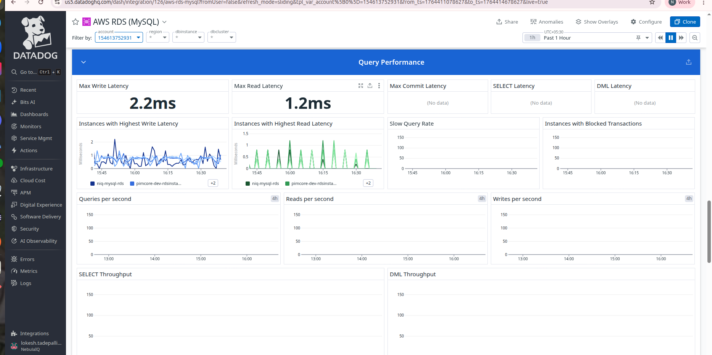
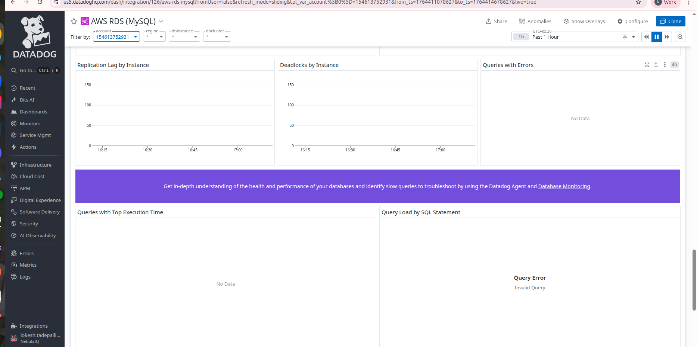
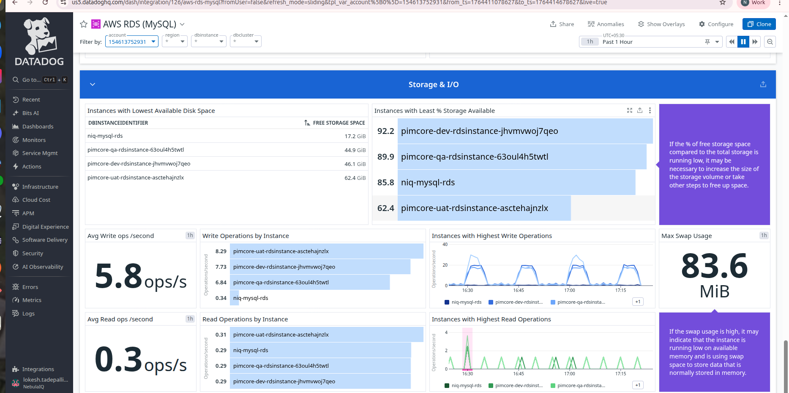

# DATADOG RDS (MySQL) DASHBOARD:

It reads metrics from CloudWatch + some from the MySQL engine, and displays the health, performance, and availability of the database.
It is specifically focused on MySQL RDS instances.

These are the 3 monitoring levels:

Standard monitoring → basic CloudWatch metrics (default)

Enhanced monitoring → OS-level metrics (CPU, memory, disk internals)

Native MySQL performance metrics → DB engine metrics
(requires mysql.can_connect check)

We currently have only standard monitoring active.

## RDS Service Status

- **Metric Name:** `mysql.can_connect`
- **Aggregation Used:** `count`
- **Units:** none
- **Legend / Tags:** none
- **Description:** Indicates whether Datadog can successfully connect to the MySQL instance.

It says:

“No value reported for service — check mysql.can_connect”

This means:

- The Datadog MySQL check is NOT configured.

- Datadog cannot connect inside the DB to read MySQL engine metrics.

- You are only receiving CloudWatch metrics (not MySQL internal metrics).

This is normal if you didn't install the Datadog agent on the RDS instance.

## Query Rate /s → 5.63k queries

- **Metric Name:** `aws.rds.queries`
- **Aggregation Used:** `sum`
- **Units:** queries/second
- **Legend / Tags:** none
- **Description:** Shows the total number of queries executed per second.

This metric tells you:

On average, RDS is processing 5,630 MySQL queries per second
(calculated over the selected time range — 1 hour).

This indicates:

- Your database is active.

- Application traffic exists.

- Datadog is successfully receiving performance metrics.

This metric is usually from: mysql.questions

## Open Connections (No data)

- **Metric Name:** `mysql.performance.threads_connected`
- **Aggregation Used:** `avg`
- **Units:** connections
- **Legend / Tags:** none
- **Description:** Number of currently open MySQL connections, collected via the Datadog MySQL integration.

This is blank because Datadog cannot run the MySQL integration unless allowed network access.

## Database Connections by Cluster (Blue Box) “0.28 conns”

- **Metric Name:** `aws.rds.database_connections`
- **Aggregation Used:** `sum`
- **Units:** connections
- **Legend / Tags:** `dbclusteridentifier`
- **Description:** Displays the total number of active database connections aggregated at the cluster level.

An RDS cluster is a group of database instances that work together as one logical database.

This means:

- Across your RDS cluster, the average number of active DB connections is 0.28.

In simple terms:

- Your database is almost idle.

- Very few requests are maintaining persistent DB connections.

This is normal if:

- You have low load

- You’re using connection pooling

Traffic is bursty

If it was high (50, 100, 500), it would indicate heavy application usage.

## Datadog groups all DB instances that belong to the same RDS cluster.

If you are using:

- Aurora MySQL

- Aurora PostgreSQL

Then you have a cluster, and that is what Datadog is showing metrics for.

If you are using:

- Standard RDS MySQL

- Standard RDS PostgreSQL

Then you may NOT have a cluster.

It will still show the “cluster” filter, but it may be empty.(as it is empty).

## CPU UTILIZATION

- **Metric Name:** `aws.rds.cpuutilization`
- **Aggregation Used:** `avg`
- **Units:** percent (%)
- **Legend / Tags:** `dbinstanceidentifier`
- **Description:** Shows average CPU usage for each RDS instance over the selected timeframe.

This block shows how much CPU every database is using.

CPU % values:

niq-mysql-rds → 3.14%

pimcore-qa-rdsinstance → 2.95%

pimcore-dev-rdsinstance → 2.88%

pimcore-uat-rdsinstance → 1.80%

What this means in simple words:

- All your databases are using very low CPU.

- None of them are overloaded.

- They have plenty of spare processing power.

- No performance issues from CPU side.

Ideal CPU range:

- 0–60% → Safe

- 60–80% → Monitor

- >80% → Danger / DB too busy

Your values are around 2–3%, which is excellent.

## Avg CPU Utilization

- **Metric Name:** `aws.rds.cpuutilization`
- **Aggregation Used:** `avg`
- **Units:** percent (%)
- **Legend / Tags:** none
- **Description:** Displays the overall average CPU utilization across selected instances.

This shows:

Avg CPU Utilization: 2.69%

Meaning:

Across all RDS instances, your average CPU load is less than 3%.

This is extremely low consumption → databases are mostly idle or lightly used.

## Instances with Highest CPU Utilization (Graph)

- **Metric Name:** `aws.rds.cpuutilization`
- **Aggregation Used:** `max`
- **Units:** percent (%)
- **Legend / Tags:** `dbinstanceidentifier`
- **Description:** Highlights RDS instances with the highest CPU usage.

The graph shows:

How CPU changed over the last 1 hour

Spikes up to 9–10% for some instances

But overall staying between 2–6%

Simple meaning:

The DB gets small bursts of activity

But no heavy load

System is stable and healthy

## AVAILABLE RAM (Memory Metrics)

- **Metric Name:** `aws.rds.freeable_memory`
- **Aggregation Used:** `avg`
- **Units:** bytes (displayed as GiB)
- **Legend / Tags:** `dbinstanceidentifier`
- **Description:** Shows available memory for each RDS instance.

This block shows how much memory (RAM) is free on each database.

Values shown:

- pimcore-dev-rdsinstance → 5.91 GiB

- pimcore-qa-rdsinstance → 5.32 GiB

- pimcore-uat-rdsinstance → 1.75 GiB

- niq-mysql-rds → 0.15 GiB (150 MB)

What this means in simple terms:

- The Pimcore DBs have plenty of free RAM (5–6 GB free).

- The UAT DB has moderate free RAM (1.75 GB).

- The NIQ DB has very low free RAM (0.15 GB).

But low free RAM in MySQL is normal because MySQL uses RAM aggressively for caching.

Still:

150 MB is low and worth monitoring.

## Instances with Least Available RAM (Graph + Forecast)

- **Metric Name:** `aws.rds.freeable_memory`
- **Aggregation Used:** `min`
- **Units:** bytes (GiB)
- **Legend / Tags:** `dbinstanceidentifier`
- **Description:** Displays the RDS instances with the lowest available memory.

The graph shows RAM trends over time.

Highlighted (in blue):

pimcore-qa-rdsinstance staying steady around 5.1–5.5 GiB free

Vertical dotted pink line:

"Forecast" → Datadog predicting RAM usage for next hour

Meaning:

Memory usage is stable.

No sudden drops → no memory leaks.

System should remain stable for next hour.

 ## NETWORK THROUGHPUT

 - **Metric Name:**  
  - Transmit: `aws.rds.network_transmit_throughput`  
  - Receive: `aws.rds.network_receive_throughput`
- **Aggregation Used:** `avg`
- **Units:** bytes/second
- **Legend / Tags:** `dbinstanceidentifier`
- **Description:** Shows outgoing and incoming network throughput for RDS instances.

This graph has two lines:

Purple = Transmit Throughput (DB sending data)

Light blue = Receive Throughput (DB receiving data)

Values are measured in kilobytes per second (KB/s).

What the graph shows:

You have 3 noticeable spikes:

Around 14:00

Around 14:15

Around 14:30

The spikes reach up to ~800 KB/s (less than 1 MB/s)

After each spike, traffic goes back to very low or near zero

What this means in simple words:

Your database is not constantly busy.

It only gets activity in short bursts.

These bursts could be:

- A scheduled job or cron job

- App sending some data at intervals

- Monitoring or health check scripts

- User activity in the application

Is this good or bad?

- This is completely normal if your application has periodic traffic.

- No signs of overload or performance issues.

- Network traffic is very small.

## DISK QUEUE DEPTH

- **Metric Name:** `aws.rds.disk_queue_depth`
- **Aggregation Used:** `max`
- **Units:** requests
- **Legend / Tags:** `dbinstanceidentifier`
- **Description:** Displays the RDS instances with the highest number of pending disk I/O operations.

This graph shows how many database operations are waiting for the disk.

Imagine your disk is a shop counter:

If queue depth is 0 → No one is waiting. Good.

If queue depth is 5–10 → People are waiting. Slow performance.

If queue depth is 30+ → Serious overload.

What the graph shows:

Very small, tiny activity spikes (close to zero)

One slightly taller spike around 03:00 AM

But almost everything is 0 to 0.02 requests queued

Simple meaning:

Your database storage is never waiting or overloaded.

Disk operations are fast and smooth.

No performance issues with storage.

Why that small spike?

Probably:

- A backup job

- A maintenance task

- A query hitting disk

But even the spike is extremely small.

Final conclusion:
- Disk performance is excellent.
- No bottlenecks.

## AMAZON RDS MYSQL LOGS (Bottom Section)

It shows:

No matching results found

What this means:

- Datadog is not receiving MySQL logs from your RDS.

This is expected because you have not enabled MySQL integration.

Right now, Datadog is only receiving CloudWatch metrics, not logs or query details.

If logs were enabled, you would see: Error logs, Slow query logs, General query logs, Log count, Log volume

To fix this:

You must forward RDS logs → CloudWatch Logs → Datadog logs OR enable MySQL Integration.

## Connections by Database (Right Graph)

- **Metric Name:** `aws.rds.database_connections`
- **Aggregation Used:** `avg`
- **Units:** connections
- **Legend / Tags:** `dbinstanceidentifier`
- **Description:** Displays the average number of active database connections per RDS instance.

Numbers:

57 → niq-mysql-rds

27 → pimcore-uat-rdsinstance-...

20 → pimcore-dev-rdsinstance-...

20 → pimcore-qa-rdsinstance-...

In simple words:

These numbers are how many database sessions (connections) exist for each DB during this time range.

So at peak/average (depending on the widget config) in this 1 hour:

niq-mysql-rds had about 57 connections

UAT DB had 27

Dev and QA each had 20

A “connection” = one open link between an app and the DB.

So you can read it as:

“The NIQ DB is the most used (57 connections), then UAT, then Dev and QA.”

All of these are totally normal numbers for pooled connections – not scary.

## Connections by Database

- **Metric Name:** `aws.rds.database_connections`
- **Aggregation Used:** `avg`
- **Units:** connections
- **Legend / Tags:** `dbinstanceidentifier`
- **Description:** Shows how database connections change over time for each RDS instance.

This is a time-series graph of connections over the last 1 hour.

X-axis = time (13:55 → 14:50)

Y-axis = number of connections

Each color = one database

It’s a stacked graph, so the layers sit on top of each other.

What it’s showing:

You see repeating bumps (steps) going up and down.

When the graph rises, it means more connections were opened.

When it goes down, many connections were closed again.

## Active Transactions by Database

- **Metric Name:** `aws.rds.active_transactions`
- **Aggregation Used:** `avg`
- **Units:** count
- **Legend / Tags:** `dbinstanceidentifier`
- **Description:** Displays the number of active transactions running on each database instance over time.

This graph is basically flat at 0.

Active transaction = a query that is currently running inside a transaction (like a long INSERT/UPDATE/DELETE/SELECT that is still in progress).

Flat 0 means:

There are no long-running transactions.

Queries are coming in, getting processed, and finishing quickly.

No transaction is “stuck” and blocking others.

If it was high (e.g., 20, 50, 100):

It would indicate:

- Heavy writes

- Long-running queries

- Performance problems

You are safe — 0 means the database is quiet.

## Connections by Cluster (Bottom Right Circle)

- **Metric Name:** `aws.rds.database_connections`
- **Aggregation Used:** `sum`
- **Units:** connections
- **Legend / Tags:** `dbclusteridentifier`
- **Description:** Aggregates all database connections across the cluster and shows total connections at the cluster level.

The donut shows:

31 conns

100% share (only one cluster in this view)

Cluster here basically means: all these RDS instances together (or the group for this account/filter).

Why 31 and not 57+27+20+20?

Because this widget is using a different aggregation (for example, average over the last hour or a different grouping). The key idea is:

It’s telling you:

Across this cluster/group, there are about 31 database connections overall (on average during this time).

## Max Write Latency – 2.2 ms

- **Metric Name:** `aws.rds.write_latency`
- **Aggregation Used:** `max`
- **Units:** milliseconds (ms)
- **Description:** Maximum time taken for a write operation to complete.

“Write” = inserting/updating/deleting data.

“Latency” = how long one write takes.

2.2 ms (milliseconds) = 0.0022 seconds → very fast.

Simple meaning:

The slowest writes in the last hour still completed in about 2 milliseconds. That’s extremely healthy.

If this number were like 100–500 ms, you’d worry.

2.2 ms = great.

## Max Read Latency – 1.2 ms

- **Metric Name:** `aws.rds.read_latency`
- **Aggregation Used:** `max`
- **Units:** milliseconds (ms)
- **Description:** Maximum time taken for a read operation to complete.

“Read” = SELECT queries (getting data).

Max read latency is 1.2 ms, again very fast.

Meaning:

Even the slowest read operations were around 1 millisecond – no read performance issue.

## Max Commit Latency

- **Metric Name:** `aws.rds.commit_latency`
- **Aggregation Used:** `max`
- **Units:** milliseconds (ms)
- **Description:** Time taken for MySQL COMMIT operations (No data shown because MySQL plugin is not installed).

Commit latency = how long it takes to finish a transaction (COMMIT).

No data here usually means:

MySQL native integration / enhanced metrics for commit aren’t enabled,

or

There hasn’t been measurable commit activity in the period.

## SELECT Latency & DML Latency

- **Metric Name:** `aws.rds.select_latency`
- **Aggregation Used:** `max`
- **Units:** milliseconds (ms)
- **Description:** Time taken for SELECT queries (No data shown — MySQL integration required).

SELECT latency → specific latency for SELECT queries

## DML latency → latency for DML operations (INSERT, UPDATE, DELETE)

- **Metric Name:** `aws.rds.dml_latency`
- **Aggregation Used:** `max`
- **Units:** milliseconds (ms)
- **Description:** Latency of Data Manipulation Language (INSERT, UPDATE, DELETE) operations.

No data again means:

Those specific DB-engine-level metrics are not available yet (likely need MySQL integration), or traffic is too low.

## Instances with Highest Write Latency

- **Metric Name:** `aws.rds.write_latency`
- **Aggregation Used:** `avg`
- **Units:** ms
- **Legend Tags:** `dbinstanceidentifier`
- **Description:** Shows which DB instances have the highest write latency over time.

Line graph by time (past 1 hour).

Y-axis = milliseconds.

Each colored line = one DB instance (niq-mysql-rds, pimcore-dev…, etc.).

You see:

Values bouncing mostly between 0 and 2 ms.

Simple meaning:

All databases are writing very quickly, usually under 2 ms. No scary spikes.

## Instances with Highest Read Latency

- **Metric Name:** `aws.rds.read_latency`
- **Aggregation Used:** `avg`
- **Units:** ms
- **Legend Tags:** `dbinstanceidentifier`
- **Description:** Shows read latency patterns for each instance.

Same idea but for reads.

You see:

Spiky green lines under ~1.5 ms.

Meaning:

Reads have tiny spikes but still under 1–1.5 ms, which is excellent.

## Slow Query Rate – empty graph

- **Metric Name:** `aws.rds.slow_query`
- **Aggregation Used:** `sum`
- **Units:** count
- **Description:** Number of queries that exceeded the server-defined slow query threshold.

This would show:

How many queries are classified as slow per second.

Empty =:

Either slow-query logging / integration isn’t enabled

Or simply no slow queries detected.

Given your latency numbers are tiny, it’s very likely no slow queries.

## Instances with Blocked Transactions – flat at 0

- **Metric Name:** `aws.rds.blocked_transactions`
- **Aggregation Used:** `sum`
- **Units:** count
- **Description:** Shows number of transactions waiting for locks.

Blocked transaction = one query waiting because another one is locking the same rows/table.

Flat line at 0 means:

No transactions are blocked. Nothing is stuck waiting on locks.

This is very good.

## Queries per second / Reads per second / Writes per second

Queries/second:
- **Metric Name:** `aws.rds.queries`
- **Aggregation Used:** `avg`
- **Units:** queries/second
- **Description:** Total number of queries processed per second.

Reads/second:
- **Metric Name:** `aws.rds.read_io_ops`
- **Aggregation Used:** `avg`
- **Units:** operations/second
- **Description:** Total read operations per second.

Writes/second:
- **Metric Name:** `aws.rds.write_io_ops`
- **Aggregation Used:** `avg`
- **Units:** operations/second
- **Description:** Total write operations per second.

For each:

X-axis = time (over 4 hours – see “4h” label).

Y-axis = number of operations per second.

Graphs look essentially very low / almost flat.

Meaning:

DB is not handling a heavy load.

Only a small number of queries per second are coming in, or the metric isn’t populated for all instances without deeper integration.

In simple words:

Right now, the database is not very busy in terms of volume.

## SELECT Throughput and DML Throughput

SELECT Throughput:
- **Metric Name:** `aws.rds.select_throughput`
- **Aggregation Used:** `avg`
- **Units:** operations/second
- **Description:** Number of SELECT queries processed per second.

DML Throughput: 
- **Metric Name:** `aws.rds.dml_throughput`
- **Aggregation Used:** `avg`
- **Units:** operations/second
- **Description:** Number of DML queries processed per second.
  
These would show volume of SELECT vs INSERT/UPDATE/DELETE over time.

Currently empty → again, likely need MySQL integration or there isn’t enough data.

## Replication Lag by Instance (left graph)

- **Metric Name:** `aws.rds.replication_lag`
- **Aggregation Used:** `avg`
- **Units:** seconds
- **Description:** Shows how many seconds a read replica is behind the primary database in applying transactions.  
  (No data shown — replication is not enabled for these instances.)

What it is:

Used when you have replicas (one main DB + one or more copies).

Replication lag = how many seconds the replica is behind the main DB.

Example:
If main DB gets a write now, and replica gets it 5 seconds later → lag = 5 seconds.

In your graph:

The line is flat at 0.

No spikes, no values.

We either don’t have replicas, or there is no delay between main DB and replicas.
There is no replication problem.

So nothing to worry about here.

## Deadlocks by Instance (middle graph)

- **Metric Name:** `aws.rds.deadlocks`
- **Aggregation Used:** `sum`
- **Units:** count
- **Description:**  Displays the number of deadlocks detected in the database. A deadlock happens when two queries block each other.  
  (No data shown — deadlocks did not occur.)

What is a deadlock?

Two queries block each other:

Query A waits for Query B

Query B waits for Query A

Neither can move → “deadlock”.

Databases then abort one of them.

In your graph:

The line is at 0 for the whole timeline.

No deadlocks recorded.

There were no situations where queries locked each other.
No deadlock issues in the last hour.

Again, very good.

## Queries with Errors (right box)

- **Metric Name:** `aws.rds.query_errors`
- **Aggregation Used:** `sum`
- **Units:** count
- **Description:** Shows how many queries resulted in an error. (No data shown — no query errors detected.)

This widget should show:

Count of queries that failed (syntax error, permission denied, etc.).

But your box says: No Data

Either there were no queries with errors
OR error-level monitoring from inside MySQL is not enabled.

Given your environment is light and you haven’t enabled full DB monitoring, both are possible. But practically, you can treat it as:

We didn’t see any DB errors in this dashboard.

## Queries with Top Execution Time (bottom left)

- **Metric Name:** `aws.rds.query_execution_time`
- **Aggregation Used:** `max`  
- **Units:** milliseconds (ms)
- **Description:** Identifies the slowest-running queries by execution duration. (No data shown — MySQL performance schema plugin may not be enabled.)

This would normally show:

The slowest queries (which SQL took the longest).

Helpful to find “bad” queries.

Right now it shows:

“No Data”

We are not collecting per-query data yet, so Datadog cannot list slow queries.

You need Database Monitoring / MySQL integration to fill this.

## Query Load by SQL Statement (bottom right)

- **Metric Name:** `aws.rds.queries`
- **Aggregation Used:** `sum`
- **Units:** count  
- **Description:** Shows query load broken down by SQL statements (e.g., SELECT, UPDATE). Helps identify heavy or frequently used query types.  
  In this screenshot, Datadog displays a **Query Error**, which means the SQL query in the widget is misconfigured.

This would normally show:

Which SQL statements generate the most load (CPU/IO/time).

For example:

SELECT * FROM orders

UPDATE users SET ...

It says:

Query Error – Invalid Query

The panel is trying to run an internal Datadog query to fetch SQL-level data,
but that data source isn’t available, so the query fails.

This again is because:

Database Monitoring (DBM) is not enabled,

Or the MySQL integration is not set up to collect query samples.

## Instances with Lowest Available Disk Space (Left)

- **Metric Name:** `aws.rds.free_storage_space`
- **Aggregation Used:** `avg`
- **Units:** bytes (displayed as GiB in UI)
- **Tags / Legend:** `dbinstanceidentifier`
- **Description:** Shows how much free storage is left on each RDS instance. Helps identify instances close to running out of disk.
  
This shows how much free storage is left for each RDS instance.

Values shown:

Instance	Free Storage
- niq-mysql-rds	17.2 GiB
- pimcore-qa	44.9 GiB
- pimcore-dev	46.1 GiB
- pimcore-uat	62.4 GiB

niq-mysql-rds has the least free space → 17.2 GiB, but this is still okay.

All other databases have plenty of disk space (45–62 GiB).

When this becomes dangerous:

If free space goes below 10% of total disk → performance becomes slow and database may crash.

Right now → Nothing is alarming.

## Instances with Least % Storage Available (Right)

- **Metric Name:** `aws.rds.free_storage_space`
- **Aggregation Used:** `avg`, then converted to percentage of total allocated storage
- **Units:** percent (%)
- **Tags / Legend:** `dbinstanceidentifier`
- **Description:** Displays free storage as a **percentage**, used to determine low-space alerts.

This shows the percentage of free storage left, not the actual GiB.

Values:

- pimcore-dev → 92.2% free

- pimcore-qa → 89.9% free

- niq-mysql-rds → 85.8% free

- pimcore-uat → 62.4% free

All databases have LOTS of storage left.

No risk of running out of disk.

UAT has the least, but even it is safe.

The purple message explains:

“If free storage % is low, consider increasing storage."

Not needed now.

## Average Write Operations per Second (Middle)

- **Metric Name:** `aws.rds.write_iops`
- **Aggregation Used:** `avg`
- **Units:** operations per second (ops/s)
- **Description:** Average number of write operations happening per second across RDS instances.

You see:

5.8 ops/s (operations per second)

This means:

Across all DBs, on average, there are 5–6 write operations happening every second.

A write operation = insert / update / delete.

Databases are handling a small but active amount of writes.
Not high, not zero — normal load.

## Write Operations by Instance

- **Metric Name:** `aws.rds.write_iops`
- **Aggregation Used:** `avg`
- **Units:** ops/s
- **Tags / Legend:** `dbinstanceidentifier`
- **Description:** Shows write I/O activity broken down by each RDS instance.
  
You see values like:

- pimcore-uat → 8.29 ops/s

- pimcore-dev → 7.73 ops/s

- pimcore-qa → 6.84 ops/s

- niq-mysql-rds → 0.34 ops/s

Layman meaning:

Pimcore databases are active and writing data regularly.

niq-mysql-rds is almost idle (very few writes).

This is absolutely normal—depends on the application usage.

## Instances with Highest Write Operations (Graph)

- **Metric Name:** `aws.rds.write_iops`
- **Aggregation Used:** `avg`
- **Units:** ops/s
- **Tags / Legend:** `dbinstanceidentifier`
- **Description:** Time-series graph showing which instances generate the highest write I/O load.

This graph shows write spikes over time.

You see repeated peaks.

Applications send batches of writes every few minutes.
Write load goes up, then down—normal application behavior.

No danger here.

## Average Read Operations per Second (Middle Left)

- **Metric Name:** `aws.rds.read_iops`
- **Aggregation Used:** `avg`
- **Units:** operations per second (ops/s)
- **Description:** Average number of read operations per second across RDS instances.

This shows:

0.3 ops/s

Very few reads (SELECT queries) happening.

Database is not used heavily for reading.

If this number were like 200 ops/s → heavy traffic.

Yours is tiny → light load.

## Read Operations by Instance

- **Metric Name:** `aws.rds.read_iops`
- **Aggregation Used:** `avg`
- **Units:** ops/s
- **Tags / Legend:** `dbinstanceidentifier`
- **Description:** Shows read I/O activity by each RDS instance.

Shows read ops per DB:

pimcore-uat → 0.31

pimcore-qa → 0.30

pimcore-dev → 0.29

niq-mysql-rds → 0.00 (almost no reads)

Small, uniform read traffic.
Again, this is normal especially for test/dev/QA environments.

## Instances with Highest Read Operations (Graph)

- **Metric Name:** `aws.rds.read_iops`
- **Aggregation Used:** `avg`
- **Units:** ops/s
- **Tags / Legend:** `dbinstanceidentifier`
- **Description:** Time-series view of heavy read activity across instances.

A small fluctuating line.

Reads happen occasionally but not heavily.
No readability bottlenecks.

## Max Swap Usage (Right)

- **Metric Name:** `aws.rds.swap_usage`
- **Aggregation Used:** `max`
- **Units:** bytes (displayed as MiB)
- **Description:** Shows maximum swap usage for RDS instances. High swap usage may indicate insufficient RAM.

Shows:

83.6 MiB

Swap = “extra memory” taken from disk when RAM is full.

Using swap is slower than RAM.

But 83 MB is very small — NOT dangerous.

One of your databases briefly ran low on RAM and used a tiny bit of disk as backup.
Nothing to worry about at this level.

If it was 500MB+, then it’s a performance concern.
