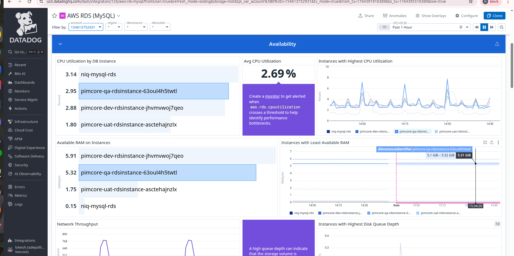
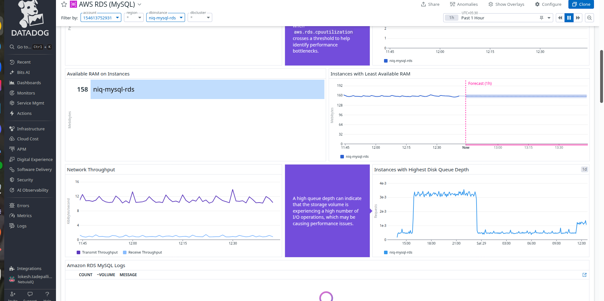
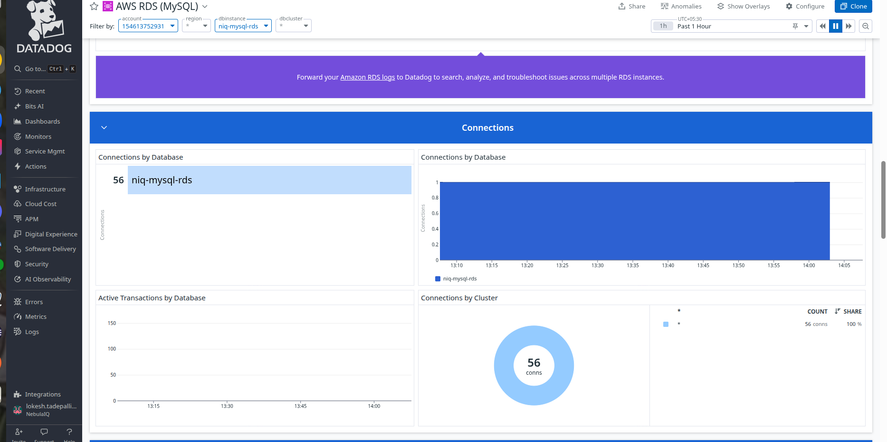

# DATADOG RDS (MySQL) DASHBOARD:

It reads metrics from CloudWatch + some from the MySQL engine, and displays the health, performance, and availability of the database.
It is specifically focused on MySQL RDS instances.

These are the 3 monitoring levels:

Standard monitoring → basic CloudWatch metrics (default)

Enhanced monitoring → OS-level metrics (CPU, memory, disk internals)

Native MySQL performance metrics → DB engine metrics
(requires mysql.can_connect check)

We currently have only standard monitoring active.

## RDS Service Status

It says:

“No value reported for service — check mysql.can_connect”

This means:

- The Datadog MySQL check is NOT configured.

- Datadog cannot connect inside the DB to read MySQL engine metrics.

- You are only receiving CloudWatch metrics (not MySQL internal metrics).

This is normal if you didn't install the Datadog agent on the RDS instance.

## Query Rate /s → 5.63k queries

This metric tells you:

On average, RDS is processing 5,630 MySQL queries per second
(calculated over the selected time range — 1 hour).

This indicates:

- Your database is active.

- Application traffic exists.

- Datadog is successfully receiving performance metrics.

This metric is usually from: mysql.questions

## Open Connections (No data)

This is blank because Datadog cannot run the MySQL integration unless allowed network access.

## Database Connections by Cluster (Blue Box) “0.28 conns”

An RDS cluster is a group of database instances that work together as one logical database.

This means:

- Across your RDS cluster, the average number of active DB connections is 0.28.

In simple terms:

- Your database is almost idle.

- Very few requests are maintaining persistent DB connections.

This is normal if:

- You have low load

- You’re using connection pooling

Traffic is bursty

If it was high (50, 100, 500), it would indicate heavy application usage.

## Datadog groups all DB instances that belong to the same RDS cluster.

If you are using:

- Aurora MySQL

- Aurora PostgreSQL

Then you have a cluster, and that is what Datadog is showing metrics for.

If you are using:

- Standard RDS MySQL

- Standard RDS PostgreSQL

Then you may NOT have a cluster.

It will still show the “cluster” filter, but it may be empty.(as it is empty).

## CPU UTILIZATION (Top Row)

3.10%   niq-mysql-rds

Meaning:

MySQL RDS instance is using 3.10% CPU.

This is VERY low, which means:

- DB is not under load

- No heavy queries

- Plenty of CPU capacity remaining

CPU Thresholds:

- 0–60% → Healthy

- >80% → Might need larger instance

- >90% → Critical

DB is extremely healthy.

## Avg CPU Utilization

You see:

3.1%

This is the average CPU usage for the selected time range (1h).

Meaning:

- Over the last hour, CPU has stayed consistently low.

- No spikes or dangerous CPU levels.

## Instances with Highest CPU Utilization (Graph)

This is a time-series graph showing the CPU usage minute-by-minute.

What it's showing:

- CPU is constantly fluctuating between 1% and 5%

- Occasional spikes up to 5–7%

- But still extremely safe

This helps detect:

- CPU spikes

- Sudden traffic bursts

- Query load cycles

Graph is stable → No unusual behavior.

## AVAILABLE RAM (Memory Metrics)

You see:

158 MB   niq-mysql-rds

Meaning:

- Your RDS instance has 158 MB of free memory (RAM).

- Note: RDS MySQL caches data heavily in RAM.
So RAM going down is normal when MySQL is fully optimized.

Thresholds:

- > 100 MB → Good

- < 50 MB → Might start swapping (slow)

- < 20 MB → Dangerous

158 MB is safe, not a problem.

## Instances with Least Available RAM (Graph + Forecast)

The graph is showing:

Your DB's free memory over time

It stays around 155–170 MB

Then Datadog gives a forecast (pink line) predicting it will stay stable for the next hour

Forecast is based on:

- Past data pattern

- Trend line

Since memory is stable, the forecast is flat.

This means:
- Your DB is not leaking memory
- No long-running queries are eating RAM
- No memory problem expected in next hour

 ## NETWORK THROUGHPUT

Two lines:

Purple = Transmit throughput (DB sending data)

Blue = Receive throughput (DB receiving data)

Values are in KB/second.

Your graph shows:

Transmit around 10–14 KB/s

Receive around 1–3 KB/s

Meaning:

- Light traffic

- Normal communication between application and DB

- No network bottlenecks

If values were very high (~5–10 MB/s), it would indicate:

- Very busy system

- Large reads/writes

- Heavy query load

We are far from that. 

## DISK QUEUE DEPTH
This measures how many disk operations are waiting to be processed.

Interpretation:

- Low queue depth (<1) → Disk is fast, no bottleneck

- High queue depth (>10) → Disk is struggling

High queue depth means many operations are waiting because storage is slow or overloaded.

Your graph shows:

A long period with slightly elevated queue depth

But still small (around 0.001–0.004)

It rises slightly and returns to normal

Meaning:
- Disk is healthy
- No write/read pressure
- No bottlenecks

The purple text box beside it explains:

A high queue depth indicates storage volume is experiencing high I/O.

But values are extremely low, so it's not a concern.

## AMAZON RDS MYSQL LOGS (Bottom Section)

This widget usually shows:

- Number of log entries

- Log volume

- Slow query logs

- Error logs

But in your screenshot: There is no data showing

This is because MySQL native integration is NOT enabled

CloudWatch does not push MySQL engine logs directly.

To see logs like:

- Slow query logs

- Error logs

- Query statements

You must enable:  Datadog MySQL Integration (mysql.can_connect)

## Connections by Database

This part of the Datadog RDS dashboard focuses only on database connections.

A “connection” means:

An application/user has opened a session with the database

Example: your backend service opening DB connections via JDBC, Hibernate, Node.js, Go, etc.

**56   niq-mysql-rds**

Meaning:

Your RDS instance niq-mysql-rds currently has 56 active DB connections.

That means 56 sessions are open between your application(s) and the database.

What this tells you

Your database is not idle.

Some services/applications are connected.

56 is a normal connection count for small or medium apps.

If this number was in the hundreds or thousands → it could indicate overload or connection leak.

## Connections by Database (Right Graph)

This graph shows how DB connections changed over the last 1 hour.

What the graph shows:

It stays around 0.9 to 1 connection in many previous minutes.

And now it jumped to 56 connections (shown in the left box).

Why is the graph showing only ~1 earlier?

Because:

At that specific time range, the DB only had ~1 active connection.

Recently (around the last few minutes), the number of connections increased.

Possible simple reasons:

- Your application just became active

- A Lambda or script started using DB

- Monitoring tools or admin clients connected

- Connection pooling created new connections

Nothing alarming unless it keeps climbing rapidly.

## Active Transactions by Database (Bottom Left Graph)

This graph is showing:

0 active transactions

Meaning:

Right now, there are no ongoing database transactions
(no long-running INSERT/UPDATE/DELETE or SELECT queries stuck)

Why this is good?

- No query is hanging

- No transaction is blocking others

Your DB is not stuck with locks

If it was high (e.g., 20, 50, 100):

It would indicate:

- Heavy writes

- Long-running queries

- Performance problems

You are safe — 0 means the database is quiet.

## Connections by Cluster (Bottom Right Circle)

You see:

56 conns

Meaning:

Your entire cluster (in your case, you have only one instance) has 56 total connections.

Why does Datadog show "cluster"?

Because:

In Aurora MySQL, you can have multiple DB instances (writer + reader)

And Datadog shows connection distribution across the cluster

But you have a single RDS instance, so:

Cluster = just one machine

Connections = same number (56)
