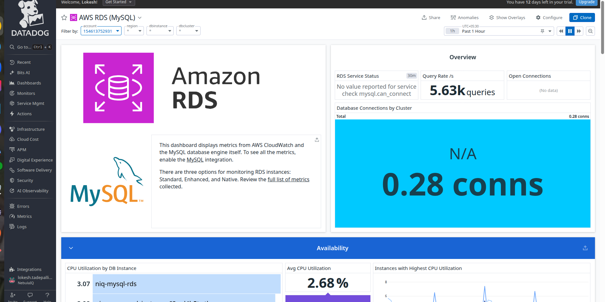

# DATADOG RDS (MySQL) DASHBOARD:

It reads metrics from CloudWatch + some from the MySQL engine, and displays the health, performance, and availability of the database.
It is specifically focused on MySQL RDS instances.

These are the 3 monitoring levels:

Standard monitoring → basic CloudWatch metrics (default)

Enhanced monitoring → OS-level metrics (CPU, memory, disk internals)

Native MySQL performance metrics → DB engine metrics
(requires mysql.can_connect check)

We currently have only standard monitoring active.

## RDS Service Status

It says:

“No value reported for service — check mysql.can_connect”

This means:

- The Datadog MySQL check is NOT configured.

- Datadog cannot connect inside the DB to read MySQL engine metrics.

- You are only receiving CloudWatch metrics (not MySQL internal metrics).

This is normal if you didn't install the Datadog agent on the RDS instance.

## Query Rate /s → 5.63k queries

This metric tells you:

On average, RDS is processing 5,630 MySQL queries per second
(calculated over the selected time range — 1 hour).

This indicates:

- Your database is active.

- Application traffic exists.

- Datadog is successfully receiving performance metrics.

This metric is usually from: mysql.questions

## Open Connections (No data)

This is blank because Datadog cannot run the MySQL integration unless allowed network access.

## Database Connections by Cluster (Blue Box) “0.28 conns”

An RDS cluster is a group of database instances that work together as one logical database.

This means:

- Across your RDS cluster, the average number of active DB connections is 0.28.

In simple terms:

- Your database is almost idle.

- Very few requests are maintaining persistent DB connections.

This is normal if:

- You have low load

- You’re using connection pooling

Traffic is bursty

If it was high (50, 100, 500), it would indicate heavy application usage.

## Datadog groups all DB instances that belong to the same RDS cluster.

If you are using:

- Aurora MySQL

- Aurora PostgreSQL

Then you have a cluster, and that is what Datadog is showing metrics for.

If you are using:

- Standard RDS MySQL

- Standard RDS PostgreSQL

Then you may NOT have a cluster.

It will still show the “cluster” filter, but it may be empty.(as it is empty).
